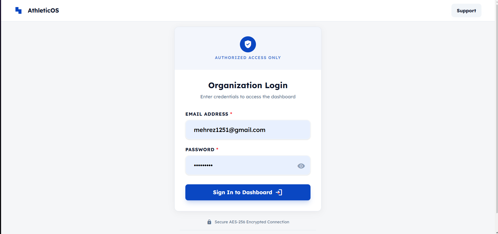
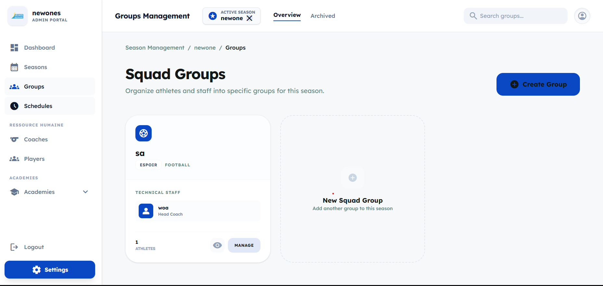
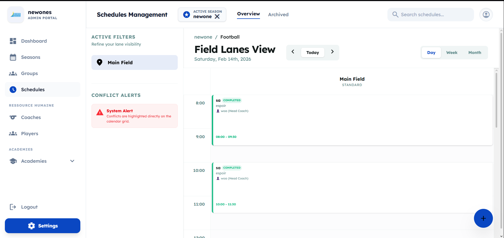

# TM-Manager (Team Manager)

A comprehensive sports and academy management system for managing teams, coaches, players, groups, schedules, and events.


## 📷 Application Screenshots

| Login Page | Dashboard |
|------------|-----------|
|  |  |

| Groups | Schedules |
|--------|-----------|
|  |  |

## 📋 Overview

TM-Manager is a full-stack web application designed to help sports academies and teams manage their day-to-day operations. It provides a complete solution for managing team identity, coaches, players, groups, training schedules, and events.

## 🛠️ Tech Stack

### Frontend
- **React 19** - UI Framework
- **Vite 7** - Build Tool
- **Tailwind CSS 4** - Styling
- **Axios** - HTTP Client
- **date-fns** - Date Manipulation

### Backend
- **Node.js** - Runtime Environment
- **Express 5** - Web Framework
- **MongoDB** - Database
- **Mongoose** - ODM
- **JWT** - Authentication
- **Bcryptjs** - Password Hashing
- **Joi** - Validation

## ✨ Features

### Authentication & Onboarding
- User registration and login with JWT tokens
- Multi-step onboarding wizard:
  - Step 1: Team Identity (name, logo, colors)
  - Step 2: Discipline Setup (sport type selection)
  - Step 3: Field Configuration (facility setup)

### Dashboard Management
- Comprehensive dashboard with multiple sections
- Quick access to all management features
- Season-based data filtering

### Team Management
- Team profile management
- Season management (create, edit, archive)
- Team settings configuration

### People Management
- **Coaches**: Create, edit, view details, assign to groups
- **Players**: Full CRUD operations, profile management, group assignment

### Group Management
- Create and manage training groups
- Assign coaches and players to groups
- View group athletes and resources

### Scheduling & Events
- Training session scheduling
- Event creation and management
- Calendar view for schedules
- Event type categorization

### Settings
- Team identity customization
- Discipline configuration
- Field/facility setup
- Account management

## 📁 Project Structure

```
TM-manager/
├── backend/                    # Express.js Backend
│   ├── config/                 # Configuration files
│   ├── controllers/            # Route controllers
│   ├── middlewares/            # Express middlewares
│   ├── models/                 # Mongoose models
│   ├── routes/                 # API routes
│   ├── utils/                  # Utility functions
│   ├── app.js                  # Express app configuration
│   ├── server.js               # Server entry point
│   ├── package.json            # Backend dependencies
│   └── config.env              # Environment configuration
│
├── frontend/                   # React Frontend
│   ├── public/                 # Static assets
│   ├── src/
│   │   ├── api/                # API service layer
│   │   ├── assets/             # Images, fonts, etc.
│   │   ├── components/        # Reusable UI components
│   │   ├── context/            # React context providers
│   │   ├── hooks/              # Custom React hooks
│   │   ├── Pages/              # Page components
│   │   │   └── Dashboard/      # Dashboard sections
│   │   ├── App.jsx             # Main app component
│   │   ├── main.jsx            # Entry point
│   │   └── index.css           # Global styles
│   ├── package.json            # Frontend dependencies
│   ├── vite.config.js          # Vite configuration
│   └── README.md               # Frontend README
│
└── README.md                   # This file
```

## ⚙️ Environment Variables

Create a file `backend/config.env` with the following variables:

```env
PORT=5000
FRONTEND_URL=http://localhost:5173
MONGO_URI=your_mongodb_connection_string
JWT_SECRET=your_secret_key
JWT_EXPIRES=7d
COOKIE_EXPIRE=7

# Optional: Email configuration (SMTP)
SMTP_HOST=smtp.gmail.com
SMTP_SERVICE=gmail
SMTP_PORT=465
SMTP_MAIL=your_email@gmail.com
SMTP_USER=your_email@gmail.com
SMTP_PASSWORD=your_app_password
FROM_NAME=Your Team Name
FROM_EMAIL=your_email@gmail.com
```

> ⚠️ **Never commit your real secrets to GitHub.** The `backend/config.env` file is already added to `.gitignore`.

## 🚀 Getting Started

### Prerequisites

- **Node.js** (v18 or higher)
- **MongoDB** (v4.2 or higher)
- **npm** or **yarn**

### Installation

1. **Clone the repository**
   ```bash
   git clone <repository-url>
   cd TM-manager
   ```

2. **Install Backend Dependencies**
   ```bash
   cd backend
   npm install
   ```

3. **Install Frontend Dependencies**
   ```bash
   cd frontend
   npm install
   ```

4. **Configure Environment Variables**
   
   Edit `backend/config.env` with your settings:
   ```env
   PORT=5000
   FRONTEND_URL=http://localhost:5173
   MONGO_URI=mongodb://127.0.0.1:27017/tm-manager
   JWT_SECRET=your-secret-key
   JWT_EXPIRES=7d
   COOKIE_EXPIRE=7
   ```
   
   > **Note**: Update the MongoDB URI to your MongoDB connection string.

5. **Start MongoDB**
   ```bash
   # Using local MongoDB
   mongod
   ```

### Running the Application

1. **Start the Backend Server**
   ```bash
   cd backend
   npm run dev
   ```
   The backend will run on `http://localhost:5000`

2. **Start the Frontend Development Server**
   ```bash
   cd frontend
   npm run dev
   ```
   The frontend will run on `http://localhost:5173`

3. **Open your browser**
   Navigate to `http://localhost:5173`

## � API Endpoints

### Authentication
| Method | Endpoint | Description |
|--------|----------|-------------|
| POST | `/api/v1/auth/register` | Register new user |
| POST | `/api/v1/auth/login` | User login |
| POST | `/api/v1/auth/logout` | User logout |
| GET | `/api/v1/auth/me` | Get current user |

### Teams
| Method | Endpoint | Description |
|--------|----------|-------------|
| GET | `/api/v1/team` | Get team details |
| PUT | `/api/v1/team` | Update team |

### Seasons
| Method | Endpoint | Description |
|--------|----------|-------------|
| GET | `/api/v1/seasons` | Get all seasons |
| POST | `/api/v1/seasons` | Create season |
| PUT | `/api/v1/seasons/:id` | Update season |
| DELETE | `/api/v1/seasons/:id` | Delete season |

### Coaches
| Method | Endpoint | Description |
|--------|----------|-------------|
| GET | `/api/v1/coaches` | Get all coaches |
| POST | `/api/v1/coaches` | Create coach |
| PUT | `/api/v1/coaches/:id` | Update coach |
| DELETE | `/api/v1/coaches/:id` | Delete coach |

### Players
| Method | Endpoint | Description |
|--------|----------|-------------|
| GET | `/api/v1/players` | Get all players |
| POST | `/api/v1/players` | Create player |
| PUT | `/api/v1/players/:id` | Update player |
| DELETE | `/api/v1/players/:id` | Delete player |

### Groups
| Method | Endpoint | Description |
|--------|----------|-------------|
| GET | `/api/v1/groups` | Get all groups |
| POST | `/api/v1/groups` | Create group |
| PUT | `/api/v1/groups/:id` | Update group |
| DELETE | `/api/v1/groups/:id` | Delete group |

### Events
| Method | Endpoint | Description |
|--------|----------|-------------|
| GET | `/api/v1/events` | Get all events |
| POST | `/api/v1/events` | Create event |
| PUT | `/api/v1/events/:id` | Update event |
| DELETE | `/api/v1/events/:id` | Delete event |

### Facilities
| Method | Endpoint | Description |
|--------|----------|-------------|
| GET | `/api/v1/facilities` | Get all facilities |
| POST | `/api/v1/facilities` | Create facility |
| PUT | `/api/v1/facilities/:id` | Update facility |
| DELETE | `/api/v1/facilities/:id` | Delete facility |

## 📝 Available Scripts

### Backend
```bash
npm run dev    # Start development server with nodemon
npm start     # Start production server
```

### Frontend
```bash
npm run dev    # Start development server
npm run build  # Build for production
npm run preview # Preview production build
npm run lint   # Run ESLint
```

## 🔧 Configuration

### Backend Environment Variables

| Variable | Description | Default |
|----------|-------------|---------|
| `PORT` | Server port | 5000 |
| `FRONTEND_URL` | Frontend URL | http://localhost:5173 |
| `MONGO_URI` | MongoDB connection string | mongodb://127.0.0.1:27017/tm-manager |
| `JWT_SECRET` | JWT signing secret | - |
| `JWT_EXPIRES` | JWT expiration time | 7d |
| `COOKIE_EXPIRE` | Cookie expiration (days) | 7 |
| `SMTP_*` | Email configuration | - |

## 🤝 Contributing

1. Fork the repository
2. Create your feature branch (`git checkout -b feature/amazing-feature`)
3. Commit your changes (`git commit -m 'Add some amazing feature'`)
4. Push to the branch (`git push origin feature/amazing-feature`)
5. Open a Pull Request

## 📄 License

This project is licensed under the ISC License.

## 👤 Author

Mehrez - [mehrez1251@gmail.com](mailto:mehrez1251@gmail.com)

---

Built with ❤️ using React and Node.js
